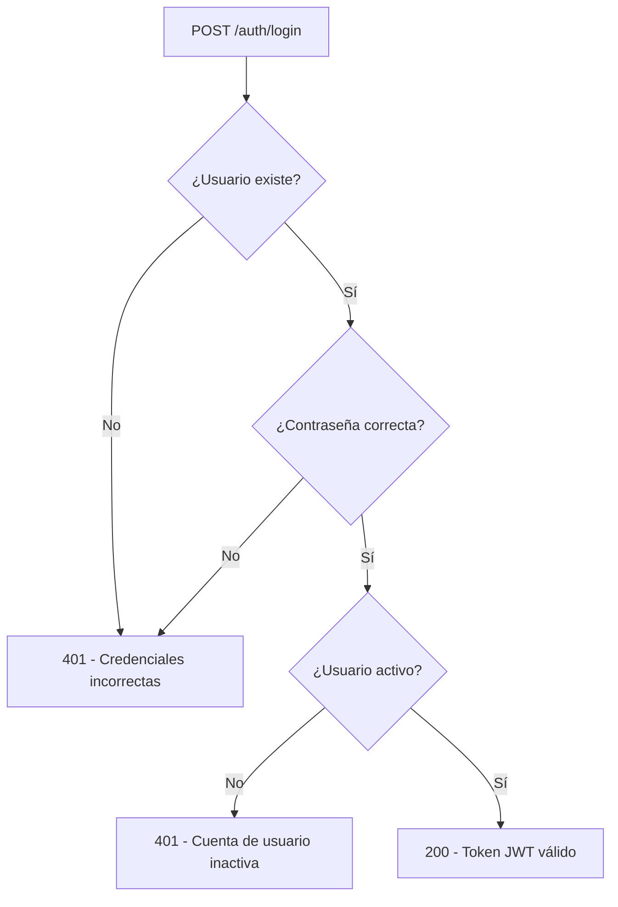

# CORRECCIÓN DE CÓDIGOS DE ESTADO HTTP EN AUTENTICACIÓN

## 🚨 PROBLEMAS IDENTIFICADOS

### 1. **Usuario Inactivo**
- **Problema:** `inactive_user` devolvía "Credenciales incorrectas" en lugar de mensaje específico
- **Causa:** La consulta SQL filtraba `AND ua.activo = TRUE`, excluyendo usuarios inactivos
- **Código de estado:** Era 401 pero con mensaje genérico ❌

### 2. **Sin Autenticación**
- **Problema:** Los endpoints sin token devolvían el mensaje correcto
- **Estado:** Ya funcionaba correctamente con 401 ✅

## ✅ SOLUCIONES IMPLEMENTADAS

### 1. **Corrección en `auth_service.py`**

#### ANTES:
```python
def authenticate_user(self, username: str, password: str) -> Optional[Dict[str, Any]]:
    with self.get_connection() as conn:
        query = """
        SELECT ua.username, ua.password_hash, ua.id_empresa, ua.rol, ua.activo,
               e.nombre as empresa_nombre
        FROM usuario_acceso ua
        JOIN empresa e ON ua.id_empresa = e.id_empresa
        WHERE ua.username = ? AND ua.activo = TRUE  # ❌ Excluía inactivos
        """
```

#### DESPUÉS:
```python
def authenticate_user(self, username: str, password: str) -> Optional[Dict[str, Any]]:
    with self.get_connection() as conn:
        query = """
        SELECT ua.username, ua.password_hash, ua.id_empresa, ua.rol, ua.activo,
               e.nombre as empresa_nombre
        FROM usuario_acceso ua
        JOIN empresa e ON ua.id_empresa = e.id_empresa
        WHERE ua.username = ?  # ✅ Incluye todos los usuarios
        """
        # ... verificación de contraseña ...
        
        # Si la contraseña es correcta, verificar si está activo
        if not user_data['activo']:
            return {'status': 'inactive', 'username': username}  # ✅ Caso especial
```

### 2. **Actualización del método `login`**

```python
def login(self, login_data: UserLogin) -> Optional[Token]:
    user = self.authenticate_user(login_data.username, login_data.password)
    
    if not user:
        return None
    
    # ✅ Verificar si es un usuario inactivo
    if isinstance(user, dict) and user.get('status') == 'inactive':
        return Token(
            access_token="",
            token_type="bearer", 
            expires_in=0,
            empresa_id=0,
            username=user['username'],
            status="inactive"  # ✅ Marcador especial
        )
```

### 3. **Actualización del endpoint de login**

```python
@router.post("/login", response_model=Token)
def login(login_data: UserLogin):
    token = auth_service.login(login_data)
    
    if not token:
        raise HTTPException(
            status_code=status.HTTP_401_UNAUTHORIZED,
            detail="Credenciales incorrectas"  # ✅ Usuario no existe o contraseña incorrecta
        )
    
    # ✅ Verificar si es un usuario inactivo
    if token.status == "inactive":
        raise HTTPException(
            status_code=status.HTTP_401_UNAUTHORIZED,
            detail="Cuenta de usuario inactiva"  # ✅ Mensaje específico
        )
```

### 4. **Actualización del modelo Token**

```python
class Token(BaseModel):
    access_token: str
    token_type: str
    expires_in: int
    empresa_id: int
    username: str
    status: Optional[str] = None  # ✅ Campo para marcar usuarios inactivos
```

## 🧪 CASOS DE PRUEBA CORREGIDOS

### ✅ **Caso 1: Sin Autenticación**
```bash
curl "http://localhost:8000/regression/predict/Interbank?fecha=2025-07-11"
```
**Resultado esperado:**
- Status: `401 Unauthorized` ✅
- Mensaje: `"Not authenticated"` ✅

### ✅ **Caso 2: Usuario Inactivo**
```bash
curl -X POST "http://localhost:8000/auth/login" \
   -H "Content-Type: application/json" \
   -d '{"username": "inactive_user", "password": "password123"}'
```
**Resultado esperado:**
- Status: `401 Unauthorized` ✅
- Mensaje: `"Cuenta de usuario inactiva"` ✅ (CORREGIDO)

### ✅ **Caso 3: Credenciales Incorrectas**
```bash
curl -X POST "http://localhost:8000/auth/login" \
   -H "Content-Type: application/json" \
   -d '{"username": "usuario_falso", "password": "password_falso"}'
```
**Resultado esperado:**
- Status: `401 Unauthorized` ✅
- Mensaje: `"Credenciales incorrectas"` ✅

### ✅ **Caso 4: Login Exitoso**
```bash
curl -X POST "http://localhost:8000/auth/login" \
   -H "Content-Type: application/json" \
   -d '{"username": "admin_interbank", "password": "password123"}'
```
**Resultado esperado:**
- Status: `200 OK` ✅
- Respuesta: Token JWT válido ✅

## 📋 FLUJO DE AUTENTICACIÓN CORREGIDO



## 🔧 ARCHIVOS MODIFICADOS

1. **`app/auth/auth_service.py`**
   - Método `authenticate_user()` - Manejo de usuarios inactivos
   - Método `login()` - Detección de usuarios inactivos

2. **`app/auth/jwt_config.py`**
   - Modelo `Token` - Campo `status` opcional

3. **`app/api/auth_routes.py`**
   - Endpoint `/auth/login` - Manejo específico de usuarios inactivos

## ✅ VERIFICACIÓN

Para verificar las correcciones:

1. **Ejecutar test completo:**
   ```bash
   python test_auth_status_codes.py
   ```

2. **Probar casos específicos:**
   ```bash
   # Sin autenticación (debe ser 401)
   curl "http://localhost:8000/regression/predict/Interbank?fecha=2025-07-11"
   
   # Usuario inactivo (debe ser 401 con mensaje específico)
   curl -X POST "http://localhost:8000/auth/login" \
      -H "Content-Type: application/json" \
      -d '{"username": "inactive_user", "password": "password123"}'
   ```

## 🎯 RESULTADO FINAL

- **✅ Códigos de estado HTTP correctos**
- **✅ Mensajes de error específicos y útiles**
- **✅ Diferenciación clara entre tipos de errores de autenticación**
- **✅ Mantenimiento de seguridad sin revelar información sensible**
