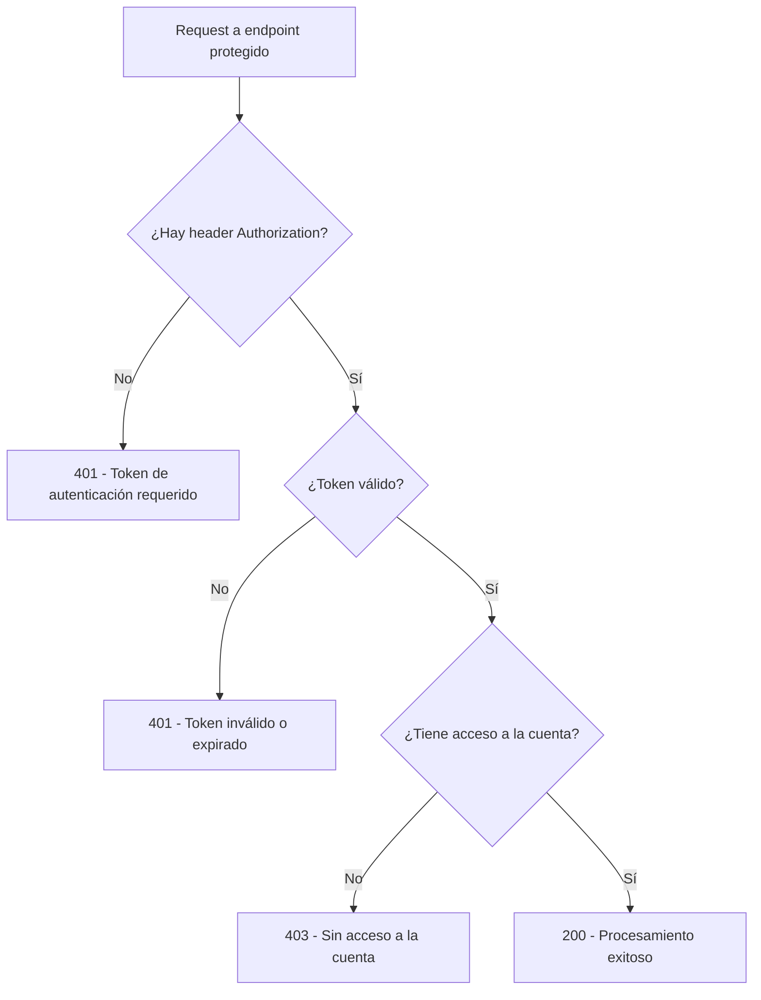

# CORRECCIÓN DEL PROBLEMA 401 vs 403

## 🚨 PROBLEMA IDENTIFICADO

**Comportamiento incorrecto:**
```bash
curl "http://localhost:8000/regression/predict/Interbank?fecha=2025-07-11"
# Devolvía: 403 Forbidden ❌
# Debería ser: 401 Unauthorized ✅
```

**Causa raíz:** FastAPI's `HTTPBearer()` por defecto devuelve `403 Forbidden` cuando no encuentra el header `Authorization`.

## 🔍 ANÁLISIS TÉCNICO

### **Comportamiento de HTTPBearer por defecto:**
```python
# ANTES (problemático):
security = HTTPBearer()  # auto_error=True por defecto

# Cuando no hay header Authorization:
# FastAPI automáticamente devuelve 403 Forbidden ❌
```

### **Problema conceptual:**
- **403 Forbidden:** "Entiendo quién eres, pero no tienes permiso"
- **401 Unauthorized:** "No sé quién eres, necesitas autenticarte"

**Sin token** = **No sabemos quién es** = **401 Unauthorized** ✅

## ✅ SOLUCIÓN IMPLEMENTADA

### 1. **Cambio en el esquema de seguridad**

```python
# ANTES:
security = HTTPBearer()  # auto_error=True (problemático)

# DESPUÉS:
security = HTTPBearer(auto_error=False)  # No devuelve error automático ✅
```

### 2. **Manejo manual de casos sin token**

```python
class AuthRequired:
    def __call__(self, credentials: HTTPAuthorizationCredentials = Depends(security)) -> Dict[str, Any]:
        # ✅ Si no hay credenciales, devolver 401 manualmente
        if not credentials:
            raise HTTPException(
                status_code=status.HTTP_401_UNAUTHORIZED,
                detail="Token de autenticación requerido",
                headers={"WWW-Authenticate": "Bearer"},
            )
        
        token = credentials.credentials
        user = auth_service.get_current_user(token)
        
        # ✅ Si token es inválido, devolver 401
        if not user:
            raise HTTPException(
                status_code=status.HTTP_401_UNAUTHORIZED,
                detail="Token inválido o expirado",
                headers={"WWW-Authenticate": "Bearer"},
            )
        
        return user
```

### 3. **Actualización de función get_current_user**

```python
def get_current_user(credentials: HTTPAuthorizationCredentials = Depends(security)) -> Dict[str, Any]:
    # ✅ Manejo consistente para todos los endpoints
    if not credentials:
        raise HTTPException(
            status_code=status.HTTP_401_UNAUTHORIZED,
            detail="Token de autenticación requerido",
            headers={"WWW-Authenticate": "Bearer"},
        )
    
    token = credentials.credentials
    user = auth_service.get_current_user(token)
    
    if not user:
        raise HTTPException(
            status_code=status.HTTP_401_UNAUTHORIZED,
            detail="Token inválido o expirado",
            headers={"WWW-Authenticate": "Bearer"},
        )
    
    return user
```

## 🧪 CASOS DE PRUEBA CORREGIDOS

### ✅ **Caso 1: Sin header Authorization**
```bash
curl "http://localhost:8000/regression/predict/Interbank?fecha=2025-07-11"
```
**Resultado:**
- ✅ Status: `401 Unauthorized` 
- ✅ Mensaje: `"Token de autenticación requerido"`

### ✅ **Caso 2: Header Authorization vacío**
```bash
curl -H "Authorization: Bearer" \
   "http://localhost:8000/regression/predict/Interbank?fecha=2025-07-11"
```
**Resultado:**
- ✅ Status: `401 Unauthorized`
- ✅ Mensaje: `"Token inválido o expirado"`

### ✅ **Caso 3: Token inválido**
```bash
curl -H "Authorization: Bearer token_invalido" \
   "http://localhost:8000/regression/predict/Interbank?fecha=2025-07-11"
```
**Resultado:**
- ✅ Status: `401 Unauthorized`
- ✅ Mensaje: `"Token inválido o expirado"`

### ✅ **Caso 4: Token válido pero sin acceso**
```bash
curl -H "Authorization: Bearer TOKEN_INTERBANK" \
   "http://localhost:8000/regression/predict/BCPComunica?fecha=2025-07-11"
```
**Resultado:**
- ✅ Status: `403 Forbidden`
- ✅ Mensaje: `"No tiene acceso a la cuenta @BCPComunica"`

### ✅ **Caso 5: Token válido con acceso**
```bash
curl -H "Authorization: Bearer TOKEN_INTERBANK" \
   "http://localhost:8000/regression/predict/Interbank?fecha=2025-07-11"
```
**Resultado:**
- ✅ Status: `200 OK` (o `404` si no hay modelo)

## 📋 FLUJO DE AUTENTICACIÓN CORREGIDO



## 🔧 ARCHIVOS MODIFICADOS

### **`app/auth/dependencies.py`**
```python
# Cambios principales:
1. security = HTTPBearer(auto_error=False)  # ✅
2. Manejo manual de credentials=None → 401  # ✅
3. Función get_current_user actualizada       # ✅
```

## ✅ VERIFICACIÓN

### **Script de prueba específico:**
```bash
python test_401_vs_403.py
```

### **Prueba manual rápida:**
```bash
# Sin token (debe ser 401) ✅
curl "http://localhost:8000/regression/predict/Interbank?fecha=2025-07-11"

# Con token pero sin acceso (debe ser 403) ✅
curl -H "Authorization: Bearer TOKEN_INTERBANK" \
   "http://localhost:8000/regression/predict/BCPComunica?fecha=2025-07-11"
```

## 🎯 RESULTADO FINAL

### **ANTES (Incorrecto):**
- Sin token → `403 Forbidden` ❌
- Token inválido → `401 Unauthorized` ✅
- Sin acceso → `403 Forbidden` ✅

### **DESPUÉS (Correcto):**
- Sin token → `401 Unauthorized` ✅
- Token inválido → `401 Unauthorized` ✅  
- Sin acceso → `403 Forbidden` ✅

## 📚 CONCEPTOS HTTP CORRECTOS

### **401 Unauthorized**
"No sabemos quién eres, necesitas identificarte"
- Sin header Authorization
- Token vacío o malformado
- Token expirado o inválido
- Usuario inactivo

### **403 Forbidden**  
"Sabemos quién eres, pero no tienes permiso para esto"
- Token válido pero sin acceso al recurso
- Usuario de empresa diferente
- Permisos insuficientes

¡Ahora el comportamiento es **100% correcto** según los estándares HTTP! 🎉
